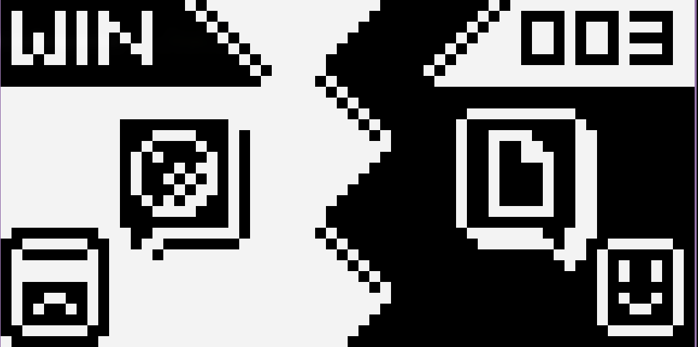
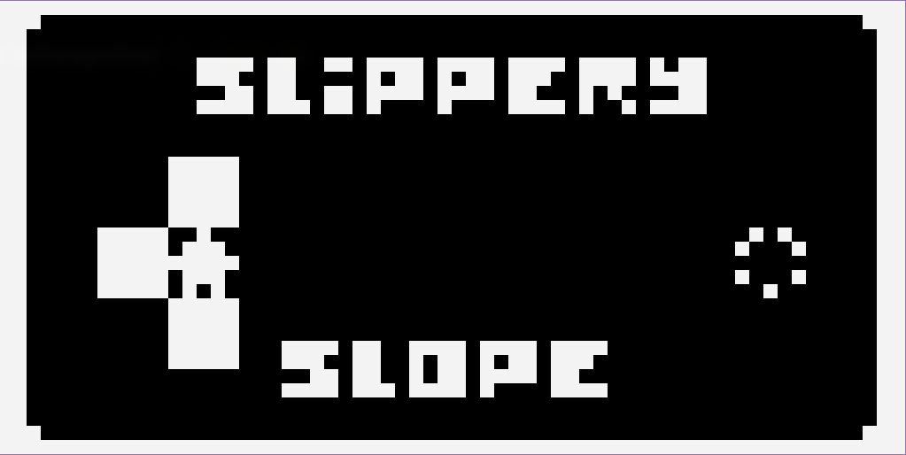
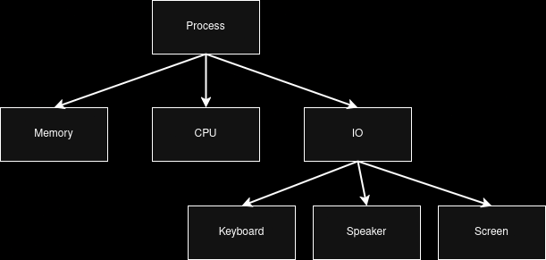
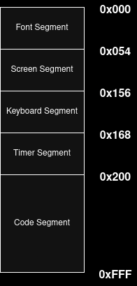
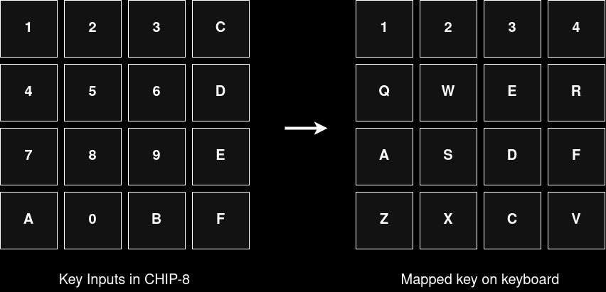
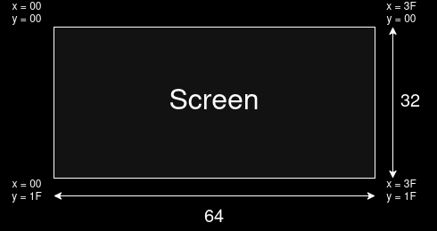

# CHIP-8 Interpreter

This is an interpreter for the [CHIP-8 programming language](https://en.wikipedia.org/wiki/CHIP-8)
which was initially used on the [COSMAC VIP](https://en.wikipedia.org/wiki/COSMAC_VIP) and
[TELMAC 1800](https://en.wikipedia.org/wiki/Telmac_1800) which were 8-bit microcomputers made in
mid 1970s <br />
<br />
The interpreter currently implements 34 of the 35 opcodes of chip 8 and passes all test cases in
the CHIP-8 test suite developed by [Timendus](https://github.com/Timendus/chip8-test-suite)<br />
<br />

## Screenshots
<p align="center">
  
  <br /> <br />
  
  <br /> <br />
  
</p>

## Usage

- Install [SDL3](https://wiki.libsdl.org/SDL3/FrontPage)

- Clone the repository
```bash
git clone https://github.com/nishantHolla/chip8-interpreter
cd chip8-interpreter
```

- Build the interpreter
```bash
make release
```

- Run the `run.sh` script and select one of the ROMs to run
```bash
./run.sh
```

## Implementation details

### Process


<br />
Process is a higher-level abstraction of a running CHIP-8 program. Each process has its own memory,
CPU and IO devices. This means the interpreter can run multiple chip 8 programs concurrently
if the host device can support it.

### Memory


<br />
The memory in the CHIP-8 interpreter is 4KB. Each CHIP-8 instruction is 16 bits wide and is stored in
memory in big-endian way. The program is loaded starting from address `0x200`. Memory address `0x00`
to `0x1FF` are reserved for the interpreter to store font data, screen pixel data, keyboard inputs,
and timers.

### CPU

The CPU of the CHIP-8 interpreter has sixteen general-purpose purpose data registers, one for each
hexadecimal digit: `V0` to `VF`. Each data register is eight bits in length. `VF` register is often
used as a flag register and is modified by some instructions.<br />
<br />
A 16-bit address register `I` is used with operations related to reading and writing memory.
<br />
A 16-bit program counter `pc` is used to keep track of the next instruction to be executed.

### Timers

The CHIP-8 interpreter has two programmable timers, the delay timer and the sound timer. Both timers
decrement to `0` at a rate of `60` times per second `(60Hzl)`. The sound timer emits a tone when its
value is non-zero.

### IO Devices

#### Keyboard



The CHIP-8 accepts input from a 16-key keypad from `0` to `F`. These keys have been mapped to a standard
QWERTY keyboard as shown above.

#### Screen



The CHIP-8 interpreter has access to a `64X32` pixel wide screen. The top left corner of the screen
is assigned the coordinates `(0x00, 0x00)` and the bottom right corner is assigned the coordinates`(0x3F, 0x1f)`.
A pixel is drawn to be white if its corresponding value is set to be anything other than `0x00` else
it is drawn to be black.

#### Speaker

A `300Hz` sine wave is played when required by the interpreter.

## Test ROMs

The Test ROMs included in this repository have been taken from these sources
- [https://github.com/Timendus/chip8-test-suite/](https://github.com/Timendus/chip8-test-suite)
- [https://github.com/kripod/chip8-roms](https://github.com/kripod/chip8-roms)
- [https://johnearnest.github.io/chip8Archive/](https://johnearnest.github.io/chip8Archive/)
